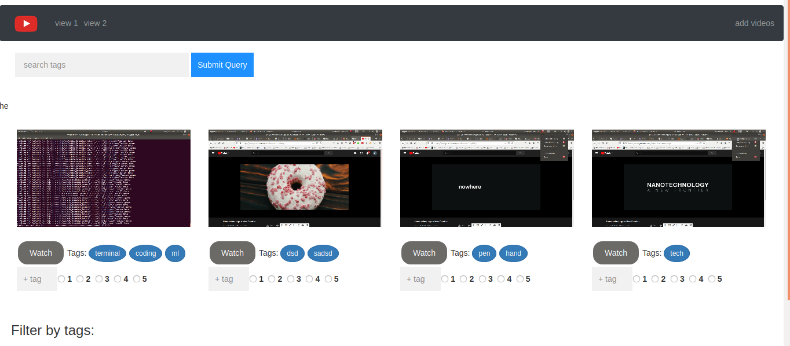
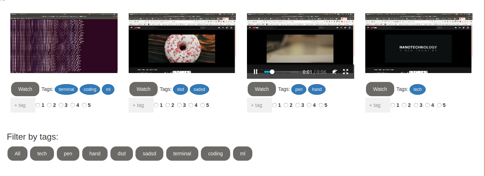
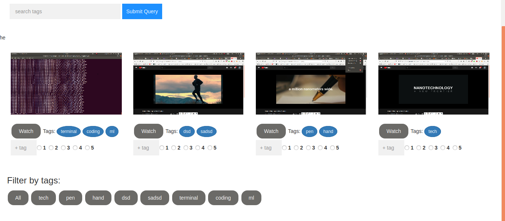

under development

# video-managment
manage video library with tagging the each video and rating them.later you can  search the video by tags

# Features
this web app can be used for local videos .for organising the videos.
you can tag the videos (adding tap to each videos)
you can give rating.
search the videos based on tag name

# how to use

step 1: create a database named  <b> video_organise </b>  
step 2: imoport database using localhost admin   

# Results
  
  
  
  
  

